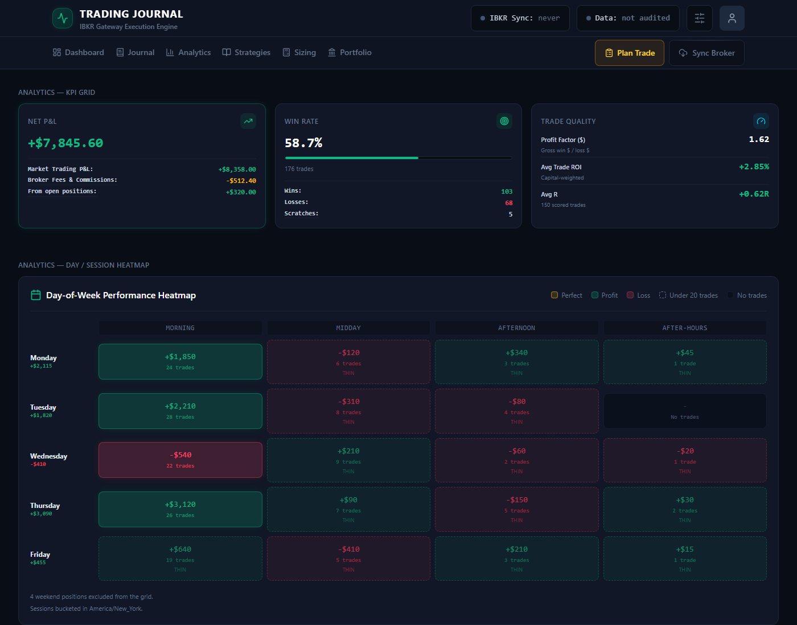
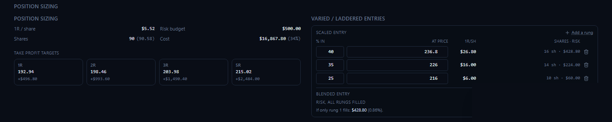
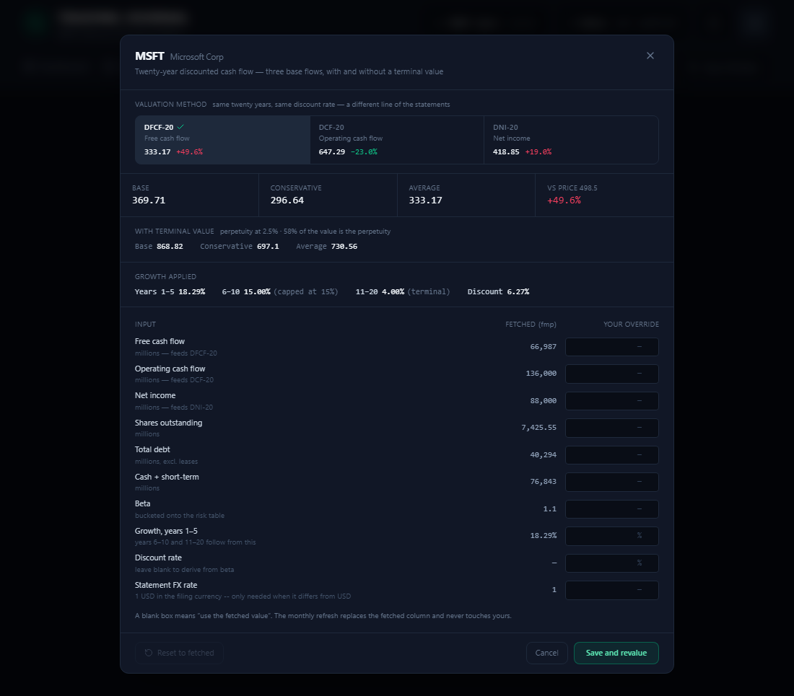

# Trading Journal

A personal execution journal and analytics dashboard for trades placed
through Interactive Brokers, plus a separate long-term investment tracker.
Two questions, two schemas: a trading journal is built around a round trip
opened and closed (FIFO matching, R-multiples, entry slippage, a discipline
checklist), while the investment book is built around a holding bought over
time and valued against what the business is worth rather than against a
stop.

This is a public, read-only mirror of a personal project -- the app itself
runs against a private production database, so there's nothing to sign into
here. It's shared for the code: migration discipline, the DCF valuation
engine, R-multiple analytics, and the reasoning trail in the commit history.
Everything below still applies if you want to run it yourself against your
own broker export and your own Postgres instance.

## Screenshots

Demo data throughout -- round numbers, common tickers, nothing from the real
account. Shown to illustrate the UI, not to claim a track record.

**Analytics.** Net P&L / win rate / trade quality at a glance, and a
day-of-week × session heatmap that marks a cell "thin" below 20 trades rather
than letting one lucky morning read the same as a real pattern.



**Position sizing.** Entry, stop and account risk in, a share count and R-ladder
of take-profit targets out -- floored, never rounded, so the sizing can't
quietly buy more risk than asked. Beside it, a laddered-entry planner for a
trade worked into over several prices against one shared stop: three tranches
that must add up to one risk figure, solved backwards from the budget.



**Portfolio valuation.** A twenty-year, three-stage discounted cash flow --
reproducing a reference valuation workbook to the cent -- run on whichever of
three base flows the toggle selects (free cash flow, operating cash flow, or
net income), each shown with and without a terminal value beyond year 20.
Every fetched input can be overridden by hand, for a holding no data provider
covers.



## Features

- **Execution journal.** Fills reconciled against IBKR's own broker records,
  FIFO-matched into round trips, scored in R-multiples against the stop that
  was actually planned -- not inferred after the fact.
- **Discipline tracking.** A per-trade checklist, a "journal lag" metric (how
  long after closing a trade it actually got logged), and a stop-integrity
  analytic that separates a clean stop-out from one that ran past its stop.
- **Order-dependent analytics.** What tends to happen after a win versus
  after a loss, and how deep into a streak -- the honest version of "revenge
  trading," measured rather than assumed.
- **Position sizing.** Risk-based share counts, an R-multiple take-profit
  ladder, and planners for both a laddered entry (several buys into one
  stop) and a scaled exit (one position, several take-profits).
- **Portfolio valuation.** The three-method DCF above, plus a manual-override
  system so a holding no API covers can still be valued by hand -- fetched
  and hand-entered inputs never overwrite each other.
- **Broker sync.** Idempotent IBKR Flex Web Service ingestion; re-running a
  sync is always safe.

## What's here

One repo, two deployables:

- **`/`** — the frontend: Next.js 16 (App Router), React 19, TanStack Query
  v5, Tailwind v4, Clerk for auth.
- **`api/`** — the backend: FastAPI + async SQLAlchemy 2.0 on Python 3.12,
  talking to a Postgres database (developed against Supabase, but any
  Postgres 17 works). See [`api/README.md`](api/README.md) for everything
  backend-specific: migrations, the sync pipeline, response caching, and the
  standalone diagnostic scripts.

Broker sync is built for IBKR's Flex Web Service specifically; using a
different broker means either hand-logging trades through the journal's own
plan/review flow or writing a new sync path.

## Prerequisites

- Node 22+
- Python 3.12
- A Postgres 17 database ([Supabase](https://supabase.com) has a free tier
  and is what this project runs against)
- A [Clerk](https://clerk.com) application (optional for a quick local
  spin-up — see below)
- An IBKR account with Flex Web Service access, only if you want real broker
  sync rather than hand-logged trades — see the `IBKR_TOKEN` and
  `IBKR_QUERY_ID` comments in `api/.env.example` for how that's configured.

## Setup

**1. Backend** — follow [`api/README.md`](api/README.md) first. In short:

```bash
cd api
pip install -r requirements-dev.txt
cp .env.example .env       # then fill in your Postgres connection string
python migrate.py          # builds the schema from nothing but the migration files
uvicorn main:app --reload
```

Come back here once that's serving on `http://localhost:8000` — visit
`http://localhost:8000/docs` for interactive API docs, and `/health` to
confirm it can reach the database.

**2. Frontend:**

```bash
npm install
cp .env.example .env.local   # then fill in real values -- see the file itself
npm run dev
```

The app is now at `http://localhost:3000`.

`.env.local` is optional for the very first run: with no Clerk keys set,
`next dev` auto-provisions a throwaway "keyless" Clerk instance so the app
boots and you can look around with an empty book. Real, persistent sign-in
needs your own Clerk app — see the comments in `.env.example` for exactly
which keys and where to find them.

**3. Getting data in.** Two ways in, and they compose:

- **Broker sync** — click "Sync Broker" once `IBKR_TOKEN` and
  `IBKR_QUERY_ID` are set (see `api/.env.example`). Pulls and matches fills
  automatically; safe to re-run.
- **By hand** — the "Plan Trade" flow logs a trade without a broker
  connection at all, which is also how the investment side works: holdings
  and transactions are entered directly, no broker integration exists there.

## Scripts

```bash
npm run dev          # start the dev server
npm run build        # production build
npm run typecheck    # tsc --noEmit
npm run lint         # eslint, capped at the current warning count
npm run test         # vitest run
npm run test:coverage
```

Backend equivalents (`cd api` first) are in
[`api/README.md`](api/README.md#tests).

## Deploying

Nothing here is tied to a specific host. This project runs on Vercel
(frontend) and Northflank (backend, via the included `api/Dockerfile`) with
Supabase Postgres, but the frontend is a standard Next.js app and the backend
is a standard containerized ASGI app — any equivalent hosts work. Whichever
you pick, the backend needs `CORS_ALLOW_ORIGINS` (or
`CORS_ALLOW_ORIGIN_REGEX`) set to wherever the frontend actually lives — see
`api/.env.example`.

The backend migrates itself on boot (see `api/start.py`) — merging a
migration and deploying it in either order is safe, so there is no separate
"remember to apply it" step to miss.
